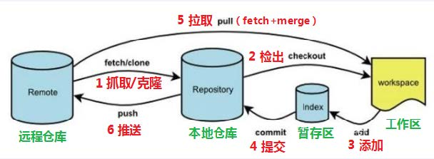

# gitNote

## (1)<font color=#FFE4B5>git_init</font>

  * 初始化流程

    ```
    git init <project-name>
    创建一个新的本地仓库(repository)[省略project-name则在当前目录创建]

    git config --global --list
    查看当前git文件的全局配置

    git config --global core.autocrlf true/input/false
    配置git pull/push 的换行符风格
    * true : 在检出代码时自动将行尾转换为CRLF(windows换行符)，在提交代码时自动将行尾转换为LF(linux/mac/unix换行符)
    * input : 在检出代码时不自动转换行尾，在提交代码时自动将行尾转换为LF
    * false : 在检出和提交时都不自动转换行尾

    git config --global user.name "your name"
    配置用户名

    git config --global user.email "mail@example.com"
    配置邮箱

    git clone <url>
    克隆一个远程仓库
    ```

  * 目录区域划分

    ```
    工作区(working directory): 在电脑中能实际看到的目录

    暂存区(stage/index): 暂存区也叫索引，用于临时存放未提交的内容，一般在.git目录下的index中

    本地仓库(repository): git在本地的版本库，仓库信息存储在.git隐藏目录中

    远程仓库(remote repository): 托管在远程服务器上的仓库，常有github, gitlab, gitee
    ```

    


  * git 3种状态/基本概念

    ```
    已经修改(modified): 修改了文件，但没保存到暂存区

    已暂存(staged): 把修改后的文件放在暂存区

    已提交(committed): 把暂存区的文件提交到本地仓库
    
    main/master : 默认主分支
    origin      : 默认远程仓库
    HEAD        : 指向当前分支的指针
    HEAD~1      : 在当前分支对应本地仓库上一次的commit的位置(上一个版本)[HEAD^]
    HEAD~4      : 上4个版本
    ```


## (2)<font color=#FFE4B5>git_operate</font>

  * 添加和提交

    ```
    git add <file>
    添加一个文件到stage
    git add .
    将所有untrack+modified文件添加到暂存区


    git commit -m "message"
    提交所有暂存区的文件到repository

    git commit -am "message"
    git commit -a -m "message"
    提交所有已修改的文件到repository
    ```

  * 查看工作区+暂存区修改状态

    ```
    git status
    ```

  * 查看提交日志

    ```
    git log +[option]
    * --pretty=oneline: 将提交信息显示为一行
    * --abbrev-commit: 使得输出commit更简单
    * --graph: 以图的形式显示
    * --all: 显示所有分支
    可以同时添加

    git reflog
    可以查看已经删除/回退的提交记录

    git diff
    查看未暂存的文件更新了哪些部分

    git diff <commit-id> <commit-id>
    查看2个提交之间的差异
    ```

    

  * 分支

    ```
    git branch
    查看所有本地分支，当前分支前面有一个星号*, 
    -r：查看远程分支
    -a: 查看所有分支

    git branch <branch-name>
    基本当前HEAD创建一个新的分支

    git checkout <branch-name>
    切换分支[存在文件名与分支名相同的情况，会优先文件]

    git switch <branch-name>
    切换分支[推荐]

    git checkout <commit-id>
    以指定的节点创建一个临时性分支
    此命令比较特殊，执行此命令后，工作区内容会变成<commit-id>提交节点内容
    但是HEAD不位于任何分支上，处于游离状态
    更确切说，此命令会在<commit-id>提交节点创建一个临时分支，被别的HEAD指向这个临时分支
    你可以在这个临时分支上修改内容+提交内容
    但是你从临时分支切换到其他分支，这个临时分支就会消失
    这种临时性分支主要用于实验性的修改，实验结束，只需要切换回原分支即可，原分支不会有任何改变
    如果你想把临时分支上的改动反映到原分支，通过git checkout -b <branch-name>
    以临时性分支的当前状态创建一个永久性分支，再把这个分支合并到原分支再删除该分支即可

    git checkout -b <branch-name>
    以当前分支的当前状态创建新分支并切换到新分支
    -b: 表示创建新分支

    git checkout -b <branch-name> <commit-id>
    以当前分支<commit-id>提交节点创建新的文字并切换到新分支，此时，工作区内容和<commit-id>提交节点是本地仓库内容保持一致

    git checkout -b <branch-name> origin/<branch-name>
    在本地创建和远端分支对应的分支(本地和远程分支的名字最好一致)

    git branch -d <branch-name>
    删除一个已经合并的分支

    git branch -D <branch-name>
    删除一个分支，不管是否合并

    git tag <tag-name>
    给当前的提交打上标签，通常用于版本发布

    git merge <branch-name>
    把<branch-name>分支合并到当前HEAD

    git rebase <branch-name>
    先寻找<branch-name>和HEAD共同的父节点，将<branch-name>改动信息变基到HEAD

    git merge --no-ff -m message <branch-name>
    合并分支
    --no-ff: 禁用Fast Forward模式，合并后的历史有分支，能查出曾经做过合并
    -ff: 表示使用Fast Forward模式，合并后历史会变成一条直线

    git squash <branch-name>
    合并&挤压(squash)所有提交到一个提交中


    ```

    

    

  * 撤销和恢复

    ```
    git rm <file>
    从工作区+暂存区删除一个文件，并且将这次删除放入暂存区

    git rm --cached <file>
    从暂存区中删除文件，但是本地工作区文件还在

    git checkout filename
    将工作区的指定文件恢复到暂存区状态

    git checkout .
    将工作区所有文件恢复到暂存区状态

    git checkout <file> <commit-id>
    恢复一个文件到之前的版本

    git revert <commit-id>
    创建一个新的commit，用来撤销指定的提交，后者所有变化都被前者抵消，并应用到当前分支
    作用：git删除已推送到远程分支的git提交
    step-1: git revert <commit-id>
    step-2: git push <remote-name> <branch-name>

    git reset --mixed <commit-id>
    重置当前分支HEAD为之前的某个提交，并且删除所有之后的提交
    --hard  : 重置工作区+暂存区
    --soft  : 重置暂存区
    --mixed : 重置工作区
    e.g. 目前有三个提交C1-C2-C3，HEAD指向C3
    git reset --soft HEAD~1
    HEAD指向C2，C3的改变保存在暂存区，同理工作区也有该文件
    git reset --mixed HEAD~1
    HEAD指向C2，但是C3的改变还未add到暂存区，工作区保持不变
    git reset --hard HEAD~1
    HEAD指向C2，C3的变化不在暂存区+工作区，工作区此时直接替换为C2的commit

    git restore --stage <file>
    撤销暂存区的文件，重新放回工作区[git add的反向操作]
    ```

    
    
    

  * 远程仓库

    ```
    git remote add <remote-name> <remote-url>
    添加远程仓库

    git remote -v
    查看远程仓库

    git remote rm <remote-name>
    删除远程仓库

    git remote rename <old-name> <new-name>
    重命名远程仓库

    git pull <remote-name> <branch-name>
    从远程仓库拉取代码，默认拉取远程仓库名origin的master/main分支
    将远端仓库的修改拉到本地并自动进行合并=fetch+merge

    git pull --rebase
    将本地改动的代码rebase到远程仓库的最新代码上[一般不建议多人开发使用，自己本地的多分支可以使用]

    git push <remote-name> <branch-name>
    推送代码到远程仓库[然后再发起pull request]

    git fetch <remote-name>
    获取所有远程分支

    git fetch <remote-name> <branch-name>
    fetch某一特定的远程分支
    ```

    
    
    


## (3)<font color=#FFE4B5>git_bug</font>

  * git合并bug

    * 问题1

    ```
    merge brach "dev"
    # Please enter a commit message to explain why this merge is necessary,
    # especially if it merges an updated upstream into a topic branch. 
    #
    # Lines starting with '#' will be ignored, and an empty message aborts
    # the commit.

    翻译:
    # 请输入提交信息，解释为什么必须合并、
    # 尤其是在将更新的上游分支合并到主题分支的情况下。
    #
    # 以 "#"开头的行将被忽略，空信息将终止
    # 提交。

    原因:
    在软件开发过程中，通常会有多个开发人员同时修改远程仓库中的不同部分，当这些修改需要合并到远程分支
    要求用户输入提交信息来解释为什么采取这次合并
    这是由于合并操作可能导致潜在的冲突和问题，为了避免混乱和误解，清晰明确的提交信息时必要的
    ```

    * 思路1

    ```
    step-1:
    :wq
    step-2:
    exit+保存
    ```

 * git配置bug

    * 问题1

    ```
    ”git init – bad numeric config value “auto” for “core.autocrlf” in

    翻译:
    git初始化中，对于参数"core.autocrlf"设置了错误的数值"auto"

    原因:
    参数"core.autocrlf"配置错误
    ```

    * 思路1

    ```
    step-1:
    git config --global --list
    列出全局配置的键值对，找到"core.autocrlf"对应的行
    step-2:
    git config --gloabal core.autocrlf true/input/false
    ```
